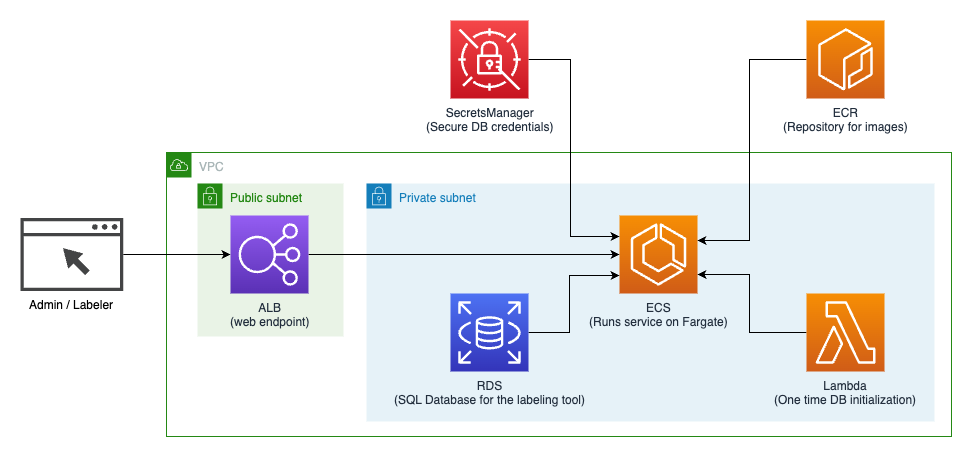

# Introduction

This AWS Sample demonstrates how you can deploy Open source machine learning labeling tools in the AWS cloud in a serverless manner, benefiting from AWS's scalability, cost-effectiveness, security and resiliency. This demonstration uses a labeling tool named Doccano, but it is just one of the many options avaialble out there. We have selected one tool randomly in order to demonstate an end to end working sample.

# Architecture

This AWS Sample uses a completely serverless architecture using AWS services such as Amazon Elastic Container Service (ECS), Amazon Relational Database Service (RDS), AWS Lamba and deploys the code with Infrastructure as Code (IaC) using AWS Cloud Development Kit (CDK). Please see the diagram below for details on how the different components work together. This AWS Sample itself contains 3 key components.

- The CDK project That deploys the entire infrastructure and makes the endpoint available to login and start labeling.
- Dockerfile and supporting scripts to containerize the labeling tool.
- A custom CDK construct implemented using AWS Lambda that demonstrates how the database can be initialized for the labeling tool.



# Prerequisites

- An AWS account and permissions to deploy the resources in the CDK.
- An Ubuntu 20+ machine to prepare and deploy the CDK.
- A VPC and atlest 2 public, 2 private and 2 isolated subnets inside it.

# Setup

- In the Ubuntu machine, run the following commands to prepare the environment.

  ```
  sudo apt update
  sudo apt upgrade -y
  sudo apt install python3 python3-pip python3-venv unzip -y

  cd ~
  python3 -m venv venv
  source ~/venv/bin/activate
  pip install git-remote-codecommit

  curl -fsSL https://deb.nodesource.com/setup_19.x | sudo -E bash - &&\
  sudo apt-get install -y nodejs

  sudo npm install -g aws-cdk

  curl "https://awscli.amazonaws.com/awscli-exe-linux-x86_64.zip" -o "awscliv2.zip"
  unzip awscliv2.zip
  sudo ./aws/install

  sudo apt install docker.io -y
  sudo systemctl start docker
  sudo systemctl enable docker
  sudo groupadd docker
  sudo usermod -aG docker $USER
  newgrp docker
  docker ps
  ```

- Clone or copy this AWS Sample into the `~` folder.
  ```
  git clone https://github.com/aws-samples/serverless-labeling-tools
  ```
- Install dependencies.

  ```
  source ~/venv/bin/activate

  cd ~/serverless-labeling-tools/lambda/db-initializer$
  npm install

  cdk ~/serverless-labeling-tools/cdk
  npm install
  ```

- Configure the CDK.

  - Setup NAT Gateway for private subnets.
  - Create a route table for the private subnets, and another for the isolated subnets.
  - Create 2 private subnets and 2 isolated subnets using the above route tables.

  - Update `cdk/bin/cdk.js` for account and region
  - Update `cdk/cdk.json` for the following.
    - VPC_ID - ID of the VPC to deploy to.
    - PUBLIC_SUBNET_IDS - IDs of the public subnets to use for the ALB.
    - PRIVATE_SUBNET_IDS - IDs of the private subnets to deploy to. Ensure to have NAT access for these private subnets.
    - ISOLATED_SUBNET_IDS - IDs of the isolated subnets to deploy the DB to.
    - DB_SIZE - Storage size of the database cluster.
    - DB_NAME - Name of the initial database to create in the cluster.
    - DB_USER_NAME - Name of the db user. The constraints depends on the labeling tool used.
    - CERTIFICATE_ARN - ARN of a certitficate to enable SSL for the ALB. Use null if a certificate is not to be used.
  - Update admin username and password in `start.sh` in the docker folder.

- Deploy the CDK project.

```
cdk ~/serverless-labeling-tools/cdk
cdk deploy
```

# Testing

Once the deployment finishes, copy the URL printed out by the CDK, and open it in a browser to start using the labeling tool.

# Tearing down

Please note that this AWS Sample may be using non-free tier capabilities and AWS will charge you for the services used. Once you are done with the stack, you can dleete it easily with CDK by running the following commands.

```
cd serverless-labeling-tools/cdk
cdk destroy
```

# Third party License notification

N.B.: Although this repository is released under the MIT-0 license, the sample labeling tool used in this case (Doccano)
use the third party projects psycopg and psycopg2. The psycopg and psycopg2 project's licensing includes the LGPL license.

Please note that this AWS Sample has selected Doccano randomly from the available set of open source labeling tools. You should be able to use any other labeling tool according to your use case, and the corresponding license may be different.

# Security

See [CONTRIBUTING](CONTRIBUTING.md#security-issue-notifications) for more information.

# License

This library is licensed under the MIT-0 License. See the LICENSE file.
